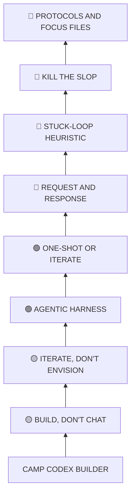

# Camp Codex builder skill tree

*Four sessions with Josh Wexler, translated into a skill tree. Each session you attended unlocks a branch. Every node is an ability you earned, written in the tooltip voice of the reference game: short, concrete, "lets you..." Spend your skill points wisely.*

---

## How to read this tree

- **Branches = sessions.** Session 1 is the trunk you climb first; each later branch assumes the ones before it.
- **Nodes = concepts and techniques** pulled from that session's material. Node labels are in caps to match the in-game style; tooltips read like the ones in the screenshots ("Security Breach: lets you breach Security Lockers").
- **SP = skill points.** Each node lists a cost. Deeper capstone nodes cost 2. The number beside each branch is the total SP to fully unlock it, the same way the reference tree shows "Mobility 38."
- **Root, arms, capstone.** Every branch opens with one Root node, splits into two themed arms that run in parallel, then converges on a Capstone at the top, mirroring the tree silhouette in the images.
- SP costs and the arm groupings are an interpretive layer added for the game feel. The tooltips themselves come straight from the session content.

**Color key:** 🟡 Foundation · 🟢 The Harness · 🔴 Architecture · 🔵 The Craft

**Total tree:** 57 SP across 49 nodes.

---

## 🟡 FOUNDATION
**Session 1 · Jun 5, 2026 · "Mindset and frameworks" · 13 SP to master**

The trunk. How to think about AI and how to work with it before you write a line of anything. Unlock this before everything else.

| Tier | Node | SP | Tooltip |
|------|------|:--:|---------|
| **Root** | **BUILD, DON'T CHAT** | 1 | Lets you create apps, automations, agents, and workflows instead of just prompting a chatbot. |
| Doctrine | **VOCABULARY FIRST** | 1 | Grants the technical vocabulary you need to navigate a field that moves a mile a minute. |
| Doctrine | **THE THREE USES** | 1 | Unlocks AI's core modes: automate a task, augment a human, enable a new skill. |
| Doctrine | **FIVE ROLES** | 1 | Lets you cast AI as assistant, co-creative partner, tutor, coach, or advisor. |
| Doctrine | **CO-CREATIVE PARTNER** | 2 | Work with the model instead of just handing off; cuts hallucinations and weak output. |
| Discipline | **RESIST THE HYPE** | 1 | Try a new tool fast, keep what works, and walk past trend-chasing like "caveman mode." |
| Discipline | **TAME THE PEOPLE PLEASER** | 1 | Make the AI confirm its plan before it runs, so it stops over-building and burning your tokens. |
| Discipline | **AGENT CAUTION** | 1 | Avoid brittle, non-deterministic agent stacks that get expensive and break down over time. |
| Discipline | **MODEL ROULETTE** | 1 | Swap between Sonnet, Opus, and Haiku to match the model to the task's complexity. |
| Discipline | **CONFIG HIERARCHY** | 1 | Project instructions take priority; Codex reads project config before your system preferences. |
| **Capstone** | **ITERATE, DON'T ENVISION** | 2 | Ship small, fail, refine; constant iteration beats one grand vision, and credits reset, so take the risk. |

*Unlock path:* start at **Build, Don't Chat**, then run the Doctrine arm (how to wield AI) and the Discipline arm (how to work) in parallel. Both feed the capstone, **Iterate, Don't Envision**, which is the mindset the rest of the tree is built on.

---

## 🟢 THE HARNESS
**Session 2 · "Agentic harnesses" · 15 SP to master**

The coding agent itself: what it is under the hood, how to extend it, and how to keep it reliable. Requires Foundation.

| Tier | Node | SP | Tooltip |
|------|------|:--:|---------|
| **Root** | **AGENTIC HARNESS** | 1 | Unlocks coding agents: wrappers around an LLM, aimed at code, with direct access to your files. |
| Anatomy | **STOCHASTIC MACHINE** | 1 | Reveals the truth under the hood; the model predicts the next token, it does not reason. |
| Anatomy | **FILE SYSTEM ACCESS** | 1 | Lets the agent read and write your real project files, which a web chatbot cannot do. |
| Anatomy | **SKILLS AS MARKDOWN** | 1 | Encode a workflow in a markdown file the agent follows; a long-form prompt with extra steps. |
| Anatomy | **TOOL USE** | 1 | Grants the agent hands: Bash commands, file search, and more. |
| Anatomy | **MCP LINK** | 1 | Connects the agent to outside services like Notion, Gmail, and Cloudflare. |
| Anatomy | **SUPERPOWERS** | 2 | Installs a full software-development methodology and composable skills into the agent. |
| Control | **GATHER, ACT, VERIFY** | 1 | Unlocks the core agent loop and the human-in-the-loop checkpoint that keeps it honest. |
| Control | **VERSION CONTROL** | 1 | Track every change in GitHub and roll back when an iteration breaks the build. |
| Control | **CONTEXT ROT** | 1 | Warns you that each message re-sends the past, so the model loses the thread as it fills. |
| Control | **THE 40% RULE** | 1 | Keep the context window under 40 percent for reliability, less noise, and lower cost. |
| Control | **TASK DECOMPOSITION** | 1 | Break work into small planned segments; treat the agent as a sharp employee with no memory. |
| **Capstone** | **ONE-SHOT OR ITERATE** | 2 | Choose your build: a single prompt in minutes or hours of guided iteration, and craft a small internal tool when an API fights you. |

*Unlock path:* **Agentic Harness** opens into the Anatomy arm (understand and extend the agent) and the Control arm (run it well). They converge on **One-Shot or Iterate**, the judgment call for how to actually ship a build.

---

## 🔴 ARCHITECTURE
**Session 3 · "How apps work" · 14 SP to master**

The systems beneath every app: the request cycle, the stack, and the method for planning a build. Requires The Harness.

| Tier | Node | SP | Tooltip |
|------|------|:--:|---------|
| **Root** | **REQUEST AND RESPONSE** | 1 | Reveals the cycle: the browser asks, the server fetches from a database, and HTML, CSS, and JS render the page. |
| The Stack | **CLIENT AND SERVER** | 1 | Unlocks the split between the machine asking and the machine answering. |
| The Stack | **FRONT-END, BACK-END** | 1 | Separates the rendered interface from the logic and data; static sites can skip the database entirely. |
| The Stack | **API ACCESS** | 1 | Lets systems talk and outsource hard jobs like email or auth instead of building them from scratch. |
| The Stack | **MCP STANDARD** | 1 | Anthropic's open protocol for AI interoperability; an API tuned for agents. |
| The Stack | **SUPABASE** | 2 | Grants ready-made database and authentication, so you skip the risk of rolling your own. |
| The Method | **AUTH FLOW** | 1 | Shows how credentials get checked, encrypted, against the database, and why custom auth is dangerous. |
| The Method | **GRANULAR BREAKDOWN** | 1 | Split an idea into front-end and back-end tasks and pick a stack without overkill. |
| The Method | **PRODUCT BRIEFS** | 1 | Use Superpowers to generate briefs, strategies, and phased roadmaps that keep a build clear. |
| The Method | **CLEAN DATA** | 1 | Let AI clean and label your data before you build anything on top of it. |
| The Method | **MERMAID DIAGRAMS** | 1 | Draw architecture as text so the model reads the connections accurately instead of guessing at an image. |
| **Capstone** | **STUCK-LOOP HEURISTIC** | 2 | When the AI loops or stalls, read it as context overload or a wrong path, then simplify or decompose to break free. |

*Unlock path:* **Request and Response** branches into The Stack (the pieces an app is made of) and The Method (how to plan and build one). Both lead to the **Stuck-Loop Heuristic**, the debugging instinct that keeps a build moving.

---

## 🔵 THE CRAFT
**Session 4 · "Design and optimization" · 15 SP to master**

Polish and efficiency: interfaces that do not look AI-generated, and workflows that conserve tokens and stay on target. Requires Architecture.

| Tier | Node | SP | Tooltip |
|------|------|:--:|---------|
| **Root** | **KILL THE SLOP** | 1 | Unlocks interfaces that do not read as generic AI output, held together by tight scoping. |
| Design | **MERMAID FOR ARCHITECTURE** | 1 | Ask for Mermaid syntax so the AI stops misreading your visual inputs. |
| Design | **AUDIO JOURNALING** | 1 | Talk through the happy path out loud, transcribe it, and feed it to the model as your first requirements. |
| Design | **GOOGLE STITCH** | 1 | Generate design markdown, real color palettes, and interactive components to escape the default look. |
| Design | **DESIGN HANDOFF** | 1 | Zip your design or use MCP so Claude talks straight to your design tools. |
| Design | **CSS GOTCHAS** | 1 | When a style change fails, ask the AI to find the cascade conflict and it usually spots the override. |
| Design | **SHADCN COMPONENTS** | 2 | Drop in an open-source, customizable UI library and save hours on forms and inputs. |
| Optimization | **SKIP TDD EARLY** | 1 | Build working code first; test-driven development burns tokens, so test critical paths and refactors only. |
| Optimization | **CHROME DEVTOOLS MCP** | 1 | Automate QA, debugging, and console inspection in real Chrome instead of the VS Code browser. |
| Optimization | **TERMINAL FOR CLAUDE CODE** | 1 | Run Claude Code from the terminal to dodge path errors, and select elements to point at exact code. |
| Optimization | **SUB-AGENTS** | 1 | Spin up fresh context windows mid-task, even to debate architecture; powerful, but token-hungry. |
| Optimization | **MEMORY TOOLS** | 1 | Go past markdown memory with database options like Memarch, Mem0, and Claude-Mem. |
| **Capstone** | **PROTOCOLS AND FOCUS FILES** | 2 | Turn repetitive work into reusable skills and pin your goals in a focus file so the AI stays on target. |

*Unlock path:* **Kill the Slop** opens the Design arm (make it look intentional) and the Optimization arm (make it run lean). Both converge on **Protocols and Focus Files**, the endgame skill that automates the tree back onto itself.

---

## Full tree at a glance

A condensed structural view (root and capstone per branch) for the silhouette. Every branch grows from the shared trunk.

---

*Source: Camp Codex sessions 1 to 4 (Josh Wexler). Tooltips distilled from session content; skill-point costs and arm groupings added for the game framing.*
