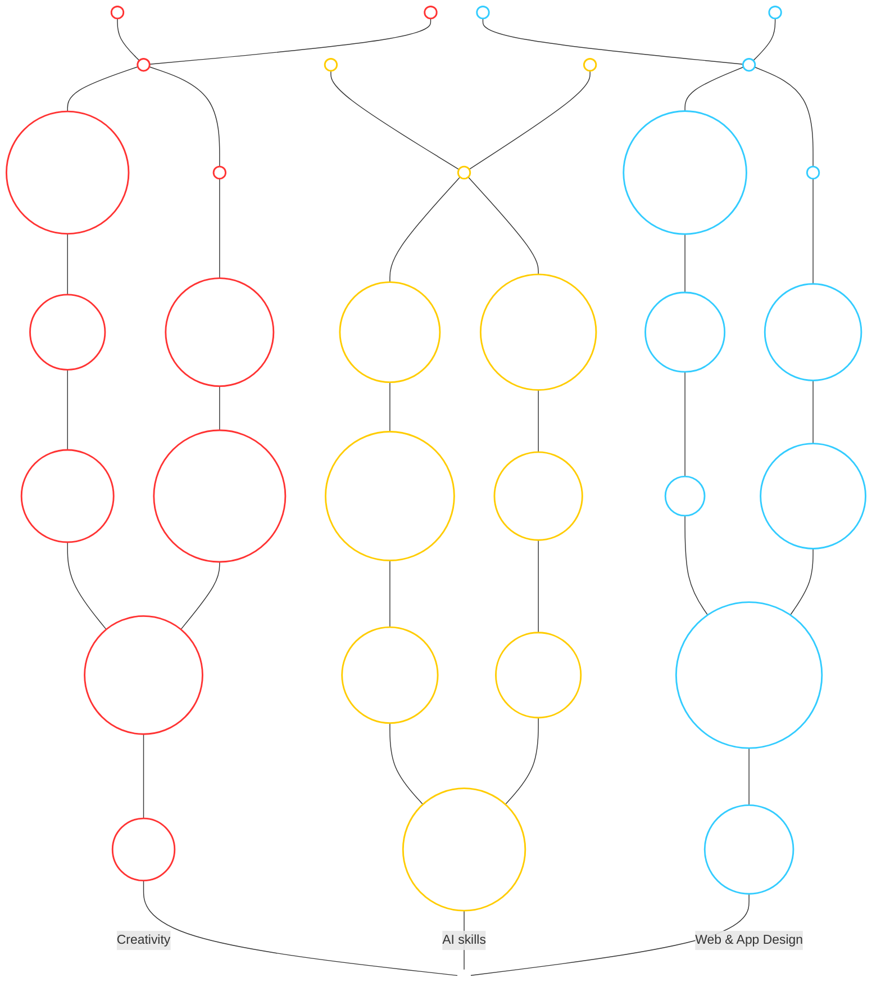

# Camp Codex Skill Tree — Build Spec

Design and build instructions for a skill tree web app. Written to be dropped into a repo and executed with Claude Code in VS Code. Read this whole file before writing any code, then follow the phases in order.

---

## 1. Project overview

**What this is:** an interactive skill tree visualizing the Camp Codex curriculum as a game-style progression map. Three branches (Creativity, AI Skills, Web & App Design) grow upward from a shared trunk, each containing 7 modules in chronological learning order. Hovering a module shows a tooltip with its name and description. Clicking a module toggles it unlocked.

**Visual reference:** the skill tree from a AAA game UI. Dark background, glowing color-coded branches connected by thick rounded paths, circular nodes with icons, branch name and point total at the base of each branch, tooltip card on hover.

**Audience:** Camp Codex participants tracking their progress through the program.

**Single job of the page:** let a user see the whole curriculum at a glance and feel progression as they unlock modules.

---

## 2. Tech stack

- Single-page app. React with Vite, or a single HTML file with vanilla JS if simpler. No backend for v1.
- SVG for the tree (paths and nodes). Do not use canvas; SVG keeps nodes hoverable and accessible.
- Plain CSS with custom properties for all tokens defined in section 4. No Tailwind unless already in the repo.
- Unlock state persists in localStorage for v1. Supabase auth and persistence is a v2 item, do not build it now.
- Deploy target: Vercel.

---

## 3. Data model

Create `src/data/skillTree.json` exactly from the content below. Every module has: `id`, `branch`, `order` (1 is closest to the trunk), `name`, `description` (the hover tooltip), `unlocked` (default false).

### Branch: creativity (color: green)

| order | name | description |
|---|---|---|
| 1 | Stay Curious | Test new tools quickly to see if they're valuable instead of getting wrapped up in the hype. |
| 2 | Burning Questions | Bring sharp questions to every session and ask AI what project would teach you what you want. |
| 3 | Own the Build | Treat AI as a co-creative partner while you steer, so the vision and decisions stay yours. |
| 4 | Start Small | Scope tightly and resist grandiose visions, because AI will happily over-build and burn your token budget. |
| 5 | Relentless Iteration | Build, fail, and refine constantly. Credits reset, so take risks and learn through the reps. |
| 6 | Demo and Feedback | Show working progress weekly and sharpen your builds through group critique, like forced pauses and blank-state handling. |
| 7 | Portfolio Mindset | Ship projects worth showcasing, then publish them publicly so your work markets itself to future opportunities. |

### Branch: ai-skills (color: blue)

| order | name | description |
|---|---|---|
| 1 | LLM Fundamentals | Understand the stochastic machine underneath. It predicts the next token, so design around that, not around intelligence. |
| 2 | Coding Agents | Wield harnesses like Claude Code and Codex that wrap an LLM with file access and tools. |
| 3 | Context Engineering | Keep context under 40 percent, clear it often, and decompose tasks so the agent never loses the plot. |
| 4 | Version Control | Track every change in GitHub and run Claude Code from the VS Code terminal to dodge path errors. |
| 5 | Skill Building | Encode repeatable workflows as markdown skill files, reusable protocols the agent follows every single time. |
| 6 | Superpowers | Install a full software development methodology into your agent, with planning, briefs, and composable skills built in. |
| 7 | MCP Connections | Connect agents to GitHub, Notion, Chrome DevTools, and design tools so AI operates your whole stack. |

### Branch: web-app-design (color: red)

| order | name | description |
|---|---|---|
| 1 | Anatomy of an App | See the request-response cycle: browser asks, server hits the database, and HTML, CSS, and JavaScript render. |
| 2 | Front-End vs Back-End | Separate the rendered interface from the logic and data, and know when a static site needs neither. |
| 3 | APIs and Supabase | Outsource hard problems like auth and databases to services instead of dangerously rolling your own. |
| 4 | Happy Path | Talk through the ideal user journey out loud, transcribe it, and feed it in as your first requirements. |
| 5 | Mermaid Blueprints | Diagram architecture as text so AI reads exact connections instead of misinterpreting a picture. |
| 6 | Design Systems | Use Google Stitch palettes and ShadCN components to escape the generic AI-generated look. |
| 7 | Automated QA | Test in real Chrome via DevTools MCP and hunt CSS conflicts when a style change won't stick. |

---

## 4. Design tokens

Define these as CSS custom properties on `:root`. Derive every color and type decision in the app from these. Do not introduce new hex values outside this list.

```css
:root {
  /* Surfaces */
  --bg: #0B0E14;              /* near-black navy, not pure black */
  --bg-glow: #131A26;         /* radial glow behind the tree center */
  --surface: #F5F2EA;         /* tooltip card, warm off-white like the reference */
  --surface-ink: #14161B;     /* text on tooltip card */

  /* Branch colors, must match the Mermaid topology in section 5 */
  --creativity: #FF3333;      /* red */
  --ai-skills: #FFCC00;       /* yellow */
  --web-design: #33CCFF;      /* blue */
  --root: #FFFFFF;            /* white, shared root node only */

  /* Node states */
  --locked-stroke: #3A4150;   /* dim gray outline for locked nodes */
  --locked-fill: #171B23;
  --unlocked-glow: 0 0 14px;  /* pair with the branch color at 60% opacity */

  /* Type */
  --font-display: "Chakra Petch", "Rajdhani", sans-serif;  /* branch labels, node names, caps */
  --font-body: "Inter", system-ui, sans-serif;             /* tooltip descriptions */
}
```

Type rules:
- Branch labels and node names: display font, uppercase, letter-spacing 0.08em.
- Tooltip name: display font, uppercase, 15px, bold. Tooltip description: body font, 13px, normal case, line-height 1.5.
- Branch point counter under each branch label: display font, large (28px), in the branch color.

The signature element of this design is the tree itself: thick rounded connector paths that glow in the branch color when the path leads to an unlocked node, and stay dim gray otherwise. Spend the visual boldness there. Keep everything else (header, tooltip, background) quiet.

---

## 5. Layout and topology

The Mermaid diagram below is the authoritative topology. Reproduce this exact node graph in the app's SVG: same connections, same left/right arm assignments, same colors. It has been rendered and approved, do not restructure it.



### Node name mapping

Diagram labels are display names. They map to the section 3 data as follows; keep the JSON `name` fields as the diagram spells them and keep the section 3 `description` text unchanged:

| Diagram label | Section 3 module |
|---|---|
| Curiosity | Stay Curious |
| LLM Fundamentals | LLM Fundamentals |
| App Anatomy | Anatomy of an App |
| Front-end vs. Back-end | Front-End vs Back-End |
| APIs | APIs and Supabase |

All other labels match section 3 exactly.

### Topology notes

- Each branch grows from the shared white root: a base node, then either a second trunk node (red and blue branches) or an immediate split (yellow branch), then two parallel arms of skill nodes, converging at an unlabeled merge node that fans into unlabeled tip nodes.
- The unlabeled nodes (R_Out3, merges, tops) are decorative connectors and future expansion slots. Render them small (roughly 60 percent of skill node diameter), always in the locked style, no tooltip, not clickable, and excluded from all counters.
- Chronological order within a branch runs bottom-up through the arms. Creativity: Curiosity, Burning Questions, then inner arm (Own the Build, Start Small, Relentless Iteration) and outer arm (Demo and Feedback, Portfolio Mindset) in parallel. AI Skills: LLM Fundamentals, then left arm (Coding Agents, Context Engineering, Version Control) and right arm (Skill Building, Superpowers, MCP Connections). Web & App Design: App Anatomy, Front-end vs. Back-end, then inner arm (APIs, Happy Path, Mermaid Blueprints) and outer arm (Design Systems, Automated QA).
- Node sizing follows the approved render: skill nodes vary between roughly 44 and 72px diameter, with longer labels getting larger circles. Labels sit inside the circles in the body font, normal case, matching the render.

- The tree grows bottom-up. One shared yellow root node sits at bottom center; the three branches split from it. Order 1 modules are nearest the root, order 7 at the top.
- Center branch (AI Skills) runs mostly vertical. Left and right branches curve outward with organic S-curves, like the reference. Use SVG cubic beziers, stroke width 6 to 8, `stroke-linecap: round`.
- Branch label and unlocked count sit at the base of each branch (e.g. "CREATIVITY" with "3" beneath it in green, counting that branch's unlocked modules).
- Nodes are circles, 44 to 56px diameter, larger for order 7 (capstone). Each contains a simple inline SVG glyph (abstract line icon is fine, no emoji).
- Desktop first at 1280px. On viewports under 768px, stack the three branches vertically as three separate columns with the trunk implied; do not try to preserve the curved layout on mobile.

---

## 6. Interactions

- **Hover (desktop) / tap (mobile):** show the tooltip card near the node: uppercase module name, then the description. Card uses `--surface` with `--surface-ink` text, 8px radius, subtle shadow. Never clip off-screen; flip side if needed.
- **Click:** toggle `unlocked`. Unlocked node fills with its branch color, gains the glow, and its connector path back toward the root lights up. Locked nodes are dim (`--locked-fill` / `--locked-stroke`) with icon at 50% opacity.
- **Sequential unlock rule:** a module can only be unlocked if its parent node in the section 5 topology is unlocked. Base nodes (Curiosity, LLM Fundamentals, App Anatomy) are always available. Where a branch splits into two arms, each arm unlocks independently along its own path. Clicking a blocked module shakes it slightly and shows the tooltip with a one-line hint: "Unlock the previous module first."
- **Counters:** the header shows total unlocked out of 21; each branch base shows its own count. Both update immediately.
- **Persistence:** save unlock state to localStorage on every toggle; hydrate on load.
- **Motion:** one orchestrated moment only. On unlock, the node scales 1.0 to 1.15 to 1.0 (250ms ease-out) and the path segment animates its glow in. Respect `prefers-reduced-motion` by skipping the scale and animating opacity only. No ambient or looping animation.
- **Accessibility:** every node is a `<button>` inside the SVG via `<foreignObject>` or an overlaid absolutely-positioned button layer. Visible keyboard focus ring in the branch color. Tooltip content mirrored in `aria-label`.

---

## 7. Build phases

Follow Camp Codex methodology while building this: plan before executing, keep context under 40 percent, clear context between phases, and commit to git at the end of every phase.

**Phase 0, plan.** Restate this spec back in your own words and list the files you will create. Confirm the plan before writing code.

**Phase 1, data and skeleton.** Scaffold the project. Create `skillTree.json` from section 3 verbatim. Render an unstyled list of all 21 modules grouped by branch to prove the data loads. Commit.

**Phase 2, tree layout.** Build the SVG directly from the section 5 Mermaid topology: white root, three branches with their dual arms, all skill nodes plus the unlabeled connector nodes, edges matching the diagram one to one. Compare your render side by side against the approved diagram before moving on. Commit.

**Phase 3, states and interactions.** Implement tokens from section 4, locked and unlocked visuals, hover tooltip, click-to-unlock with the sequential rule, counters, and localStorage. Commit.

**Phase 4, polish and QA.** Motion, reduced-motion path, keyboard access, mobile stack layout. QA in real Chrome (use Chrome DevTools MCP if available, not the VS Code browser): check console for errors, test tooltip edge clipping at viewport edges, test keyboard-only unlock flow, hard-refresh to confirm persistence. Commit.

**Phase 5, deploy.** Push to GitHub and deploy to Vercel. Verify the live URL on desktop and a phone.

---

## 8. Out of scope for v1

Do not build these now, even though they may seem adjacent: user accounts or Supabase auth, an admin editor for modules, XP or currency systems, sound effects, additional branches, and export features. If any of these feels necessary mid-build, stop and ask instead of building it.

## 9. Definition of done

- All 21 modules render in three color-coded branches in the specified order, growing from a shared root.
- Hover shows the exact name and description from section 3, unmodified.
- Sequential unlocking works, state survives a refresh, counters are accurate.
- No console errors, keyboard accessible, reduced motion respected, deployed on Vercel.
